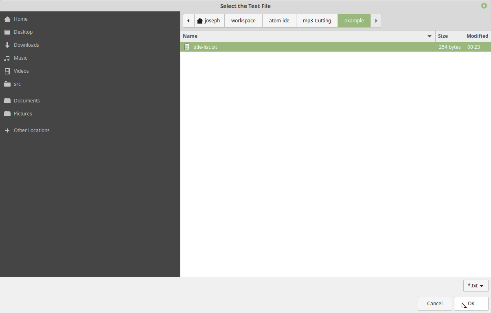
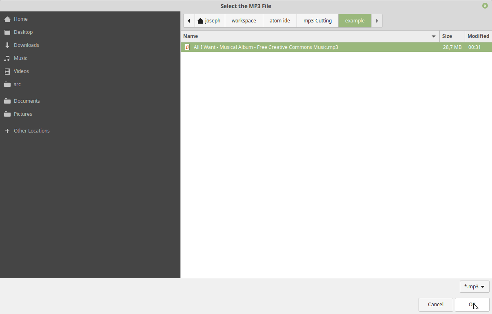
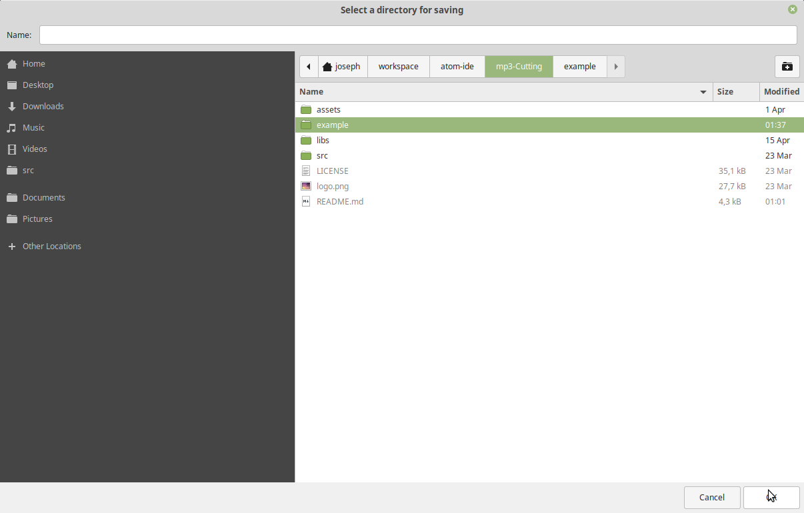
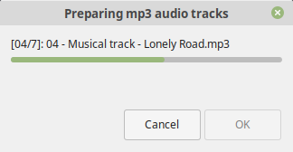
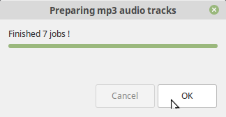

<p align="center"></p>

# mp3-Cutting
A linux based shell script to cut an mp3 file (e.g. a whole album) into several tracks in a terminal or with a simple zenity gui.

## dependencies
First of all make sure you operating system has installed the following packages.

``` bash
$:~ sudo apt-get update
$:~ sudo apt-get install zenity sox libsox-fmt-mp3
```

After that, change the mode of the shell script to executable to make it runnable:

``` bash
$:~ cd src/
$:~ chmod +x ./MP3Cutting.sh
```

Actually, the script itself will also check if all necessary packages are installed and in case of missing dependency, it will ask for it as well.

## script arguments

There are several ways to start the script. If you don't pass any arguments, it will start in the graphical user mode and will guide the user through the process.

The following arguments are possible:

``` bash
$:~ ./MP3Cutting.sh --help

    --help        Prints the command line options.
    --version     Output version information and exit.
    --no-gui      Start the script in terminal mode (without zenity gui).
    --debug       Enables Debug mode. Sox trim is disabled!
```

So if you want to use only the command line for splitting the audio file into several tracks, just type

``` bash
$:~ ./MP3Cutting.sh --no-gui
```

## examples

To make it as simple as possible, a copyright free music album was added to ```example/``` folder and we will now go through the graphical and the non graphical process of splitting this album.

So first of all, the downloaded youtube video can be found under the following [link](https://youtu.be/i00aZuA1Q7I?list=PLDAMQSMLv8niSRUCZXxrKAXhCf4RZ8ETh). You can use whatever software you want do convert it to mp3, but its necessary that it is an audio file.

#### terminal mode

We will now open a Terminal and navigate to the ```MP3Cutting.sh``` shell script.

``` bash
$:~ cd src/
$:~ ./MP3Cutting.sh --no-gui
```

After confirming that the graphical user interface is disabled, the following messages should appear:


``` bash
Package zenity found.                                                    [  OK  ]
Package sox found.                                                       [  OK  ]
Please specify the path to the title file (*.txt): ./example/title-list.txt
Please specify the path to the mp3 audio file: ./example/*.mp3
Please specify the path to store the project: ./example/
```

Now navigate to the title list text file as well as to the mp3 file; after that a output folder should also been set. The script will check the given user input parameters; in case of mistake like a file format error, the script will exit and throw an error. If everything is fine, you will see the messages underneath:

``` bash
Loading time steps into the array ...
-> timeArray[0]:        00:00:06
-> timeArray[1]:        00:01:07
-> timeArray[2]:        00:02:02
-> timeArray[3]:        00:03:34
-> timeArray[4]:        00:05:54
-> timeArray[5]:        00:08:39
-> timeArray[6]:        00:12:12
Done.

Loading music titles ...
-> titleArray[0]:       Musical track - All I Want
-> titleArray[1]:       Musical track - Cos Only You
-> titleArray[2]:       Musical track - Deep Emotions
-> titleArray[3]:       Musical track - Lonely Road
-> titleArray[4]:       Musical track - Noir
-> titleArray[5]:       Musical track - Waiting
-> titleArray[6]:       Musical track - You're Far away
Done.

Number of Elements to create: 7
Input TXT-File: ./example/title-list.txt
Input MP3-File: ./example/*.mp3
Output Directory: ./example/
EOF: After 6 Tracks
```

The script now will split the audio album into the specified tracks mentioned in the title text file. Please keep in mind, right now, the only accepted format of the text file is the following:

``` bash
# [hh]:[mm]:[ss] title-of-track

00:00:06 Musical track - All I Want
00:01:07 Musical track - Cos Only You
00:02:02 Musical track - Deep Emotions
00:03:34 Musical track - Lonely Road
00:05:54 Musical track - Noir
00:08:39 Musical track - Waiting
00:12:12 Musical track - You're Far away
```

If everything went right, you will get a confirmation message and you will now be able to listen to the created tracks.

``` bash
Finished 7 jobs !
Done.
```

#### zenity gui mode

First of all, as always, we have to start the ```MP3Cutting.sh``` shell script, but this time without any arguments.

``` bash
$:~ cd src/
$:~ ./MP3Cutting.sh
```

After that, you have to guide yourself through dialogs; actually, they are pretty obvious. First, choose the title txt file.

<p align="center"></p>

After that, you have to navigate to the mp3 audio file.

<p align="center"></p>

Furthermore, an output directory has to be set.

<p align="center"></p>

And now, a progress window shall appear to inform you about how many titles are left to process.

<p align="center"></p>

If all titles are saved to their destination, a confirmation dialog will pop up.

<p align="center"></p>

That's it ;)
